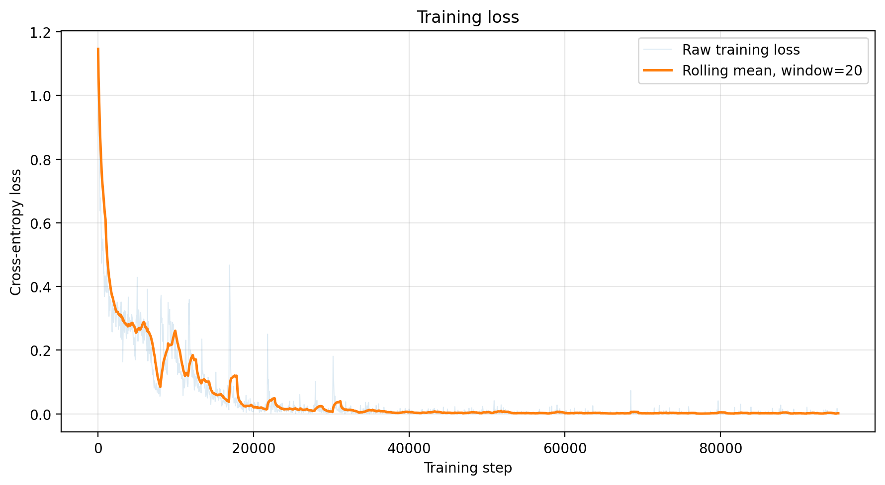
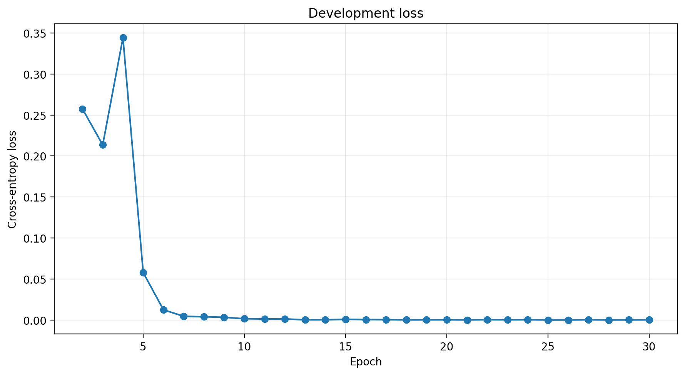
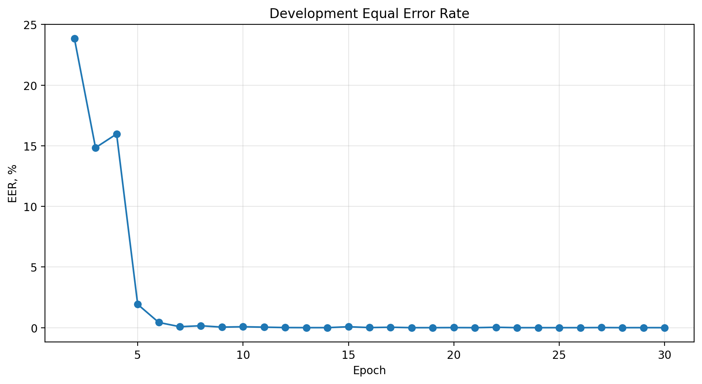
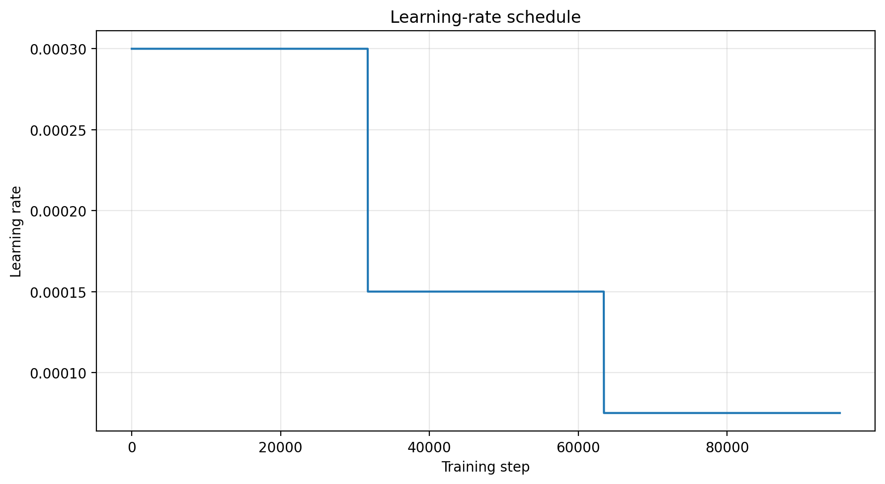

# Voice Anti-spoofing with LCNN

Проект решает задачу обнаружения синтезированной и преобразованной речи
на наборе данных ASVspoof 2019 Logical Access.

Классы:

- `bonafide` — настоящая человеческая речь;
- `spoof` — синтезированная или преобразованная речь.

## Метод

Используется архитектура Light Convolutional Neural Network с операциями
Max-Feature-Map. Аудиозаписи преобразуются в логарифмические
STFT-спектрограммы.

| Параметр | Значение |
|---|---:|
| Sample rate | 16 000 Hz |
| `n_fft` | 512 |
| `win_length` | 320 |
| `hop_length` | 160 |
| Размер входа | `1 × 257 × 750` |
| Оптимизатор | Adam |
| Начальный learning rate | `3e-4` |
| Scheduler | StepLR |
| Batch size | 8 |
| Число эпох | 30 |
| Dropout | 0.75 |
| Random seed | 1 |

Для обучения используется Cross-Entropy. Dropout расположен перед финальным
слоем BatchNorm.

## Результаты

| Разбиение | EER |
|---|---:|
| Development, лучшее значение | 0.000% |
| Evaluation | 8.292% |

Evaluation-метрики не использовались для выбора итоговой модели.

### Training loss



### Development loss



### Development EER



### Learning rate



## Weights & Biases

[Открыть W&B Report](https://api.wandb.ai/links/aquamarox-hse-university/5lghuvy6)

## Установка

```bash
git clone https://github.com/Aquamarox/Voice-Anti-spoofing-LCNN.git
cd Voice-Anti-spoofing-LCNN
pip install -r requirements.txt
```

## Данные

Датасет не включён в репозиторий. Используется ASVspoof 2019 LA со следующими
частями:

```text
ASVspoof2019_LA_train/flac
ASVspoof2019_LA_dev/flac
ASVspoof2019_LA_eval/flac
ASVspoof2019_LA_cm_protocols
```

Пути к данным задаются через Hydra-конфигурации в `src/configs`.

## Обучение

```bash
python train.py
```

Основная конфигурация:

```text
src/configs/asvspoof.yaml
```

## Генерация итогового CSV

В текущей среде Kaggle:

```bash
python generate_submission.py \
  submission.checkpoint=/kaggle/working/final_run/model_best.pth \
  submission.output_path=/kaggle/working/final_run/gsbabii.csv
```

Итоговый файл должен называться `gsbabii.csv`, содержать две колонки без
заголовка и 71 237 строк с оценками для evaluation-набора.

## Проверка контрольных точек

```bash
python checkpoint_evaluation.py list \
  --search-root /kaggle/working/final_run
```

## Структура проекта

```text
.
├── train.py
├── generate_submission.py
├── checkpoint_evaluation.py
├── src/
│   ├── configs/
│   ├── datasets/
│   ├── loss/
│   ├── metrics/
│   ├── model/
│   ├── trainer/
│   └── transforms/
└── report_assets/
```

## Метрика

Основная метрика — Equal Error Rate. Чем меньше EER, тем лучше модель
разделяет классы `bonafide` и `spoof`.
